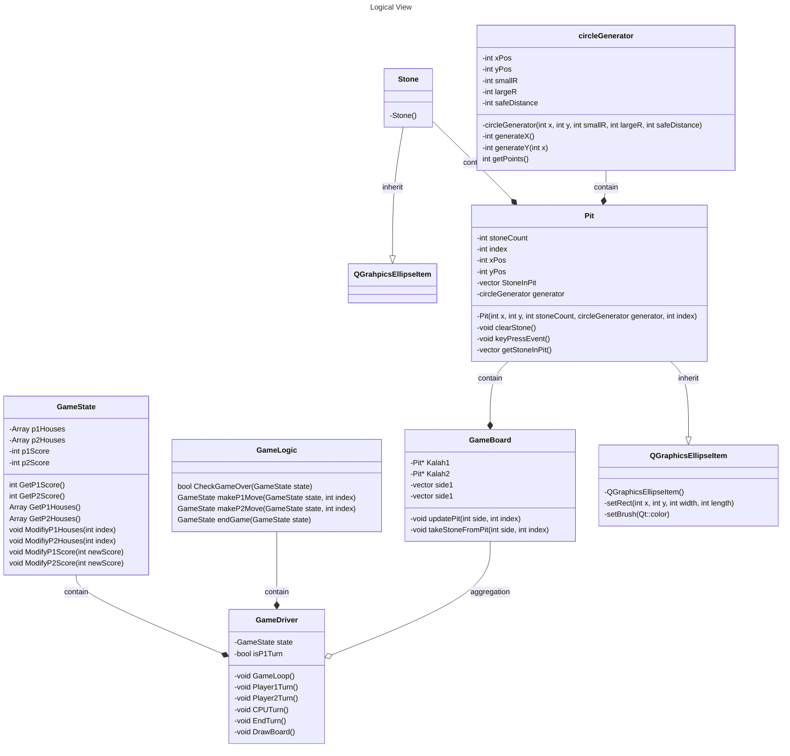

```mermaid
---
title: Logical View
--- 
classDiagram

class GameState {
    
    
    -Array p1Houses
    -Array p2Houses
    -int p1Score
    -int p2Score
    int GetP1Score()
    int GetP2Score()
    Array GetP1Houses()
    Array GetP2Houses()

    void ModifiyP1Houses(int index)
    void ModifiyP2Houses(int index)
    void ModifyP1Score(int newScore)
    void ModifyP2Score(int newScore)
    
}

class GameDriver {
    -GameState state
    -bool isP1Turn

    -void GameLoop()
    -void Player1Turn()
    -void Player2Turn()
    -void CPUTurn()
    -void EndTurn()
    -void DrawBoard()
     
}

class GameLogic{
    
    bool CheckGameOver(GameState state)
    GameState makeP1Move(GameState state, int index) 
    GameState makeP2Move(GameState state, int index) 
    GameState endGame(GameState state)
}

class GameBoard{
    -Pit* Kalah1
    -Pit* Kalah2
    -vector<Pit*> side1
    -vector<Pit*> side1

    -void updatePit(int side, int index)
    -void takeStoneFromPit(int side, int index)

}

class Pit{
    -int stoneCount
    -int index
    -int xPos
    -int yPos

    -vector<Stone*> StoneInPit
    -circleGenerator generator

    -Pit(int x, int y, int stoneCount, circleGenerator generator, int index)
    -void clearStone()
    -void keyPressEvent()
    -vector<Stone*> getStoneInPit()


}

class QGraphicsEllipseItem{
    -QGraphicsEllipseItem()
    -setRect(int x, int y, int width, int length)
    -setBrush(Qt::color)
}

class Stone{
    -Stone()
}

class circleGenerator{
    -int xPos
    -int yPos
    -int smallR
    -int largeR
    -int safeDistance

    -circleGenerator(int x, int y, int smallR, int largeR, int safeDistance)
    -int generateX()
    -int generateY(int x)
    int getPoints()
}
GameState --* GameDriver: contain
GameLogic --* GameDriver: contain
GameBoard --o GameDriver: aggregation
Pit --* GameBoard: contain
Pit --|> QGraphicsEllipseItem: inherit
Stone --|> QGrahpicsEllipseItem: inherit
Stone --* Pit: contain
circleGenerator --* Pit:contain

```
