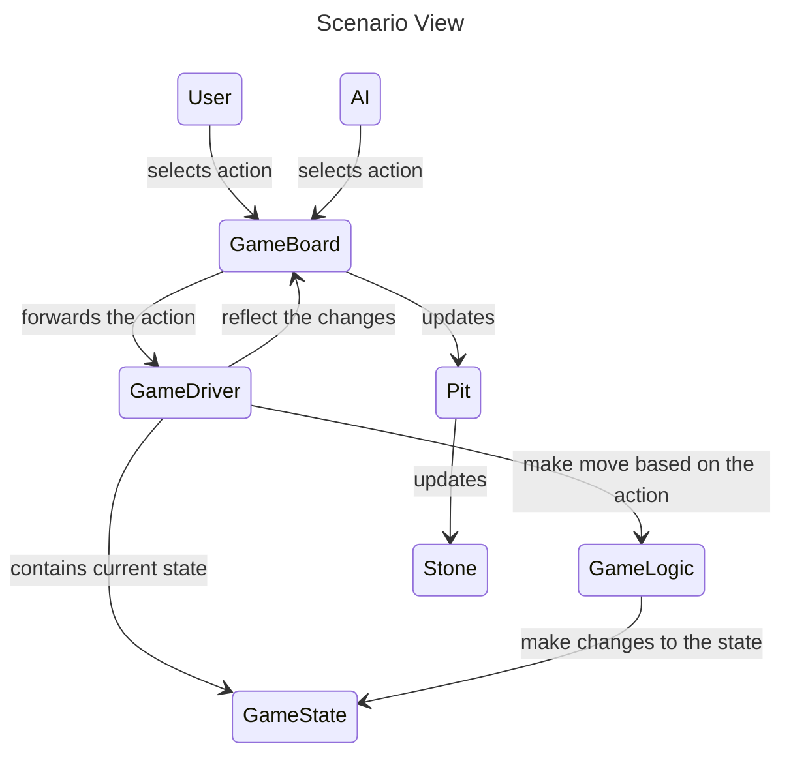

```mermaid
---
title: Scenario View
--- 
stateDiagram-v2


User --> GameBoard: selects action
AI --> GameBoard: selects action
GameBoard --> GameDriver: forwards the action
GameDriver --> GameLogic: make move based on the action
GameDriver --> GameState: contains current state
GameLogic --> GameState: make changes to the state
GameDriver --> GameBoard: reflect the changes
GameBoard --> Pit: updates
Pit --> Stone: updates


```
